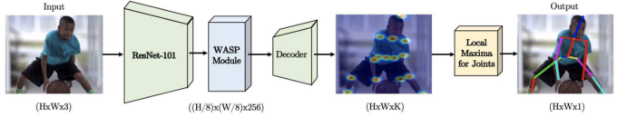
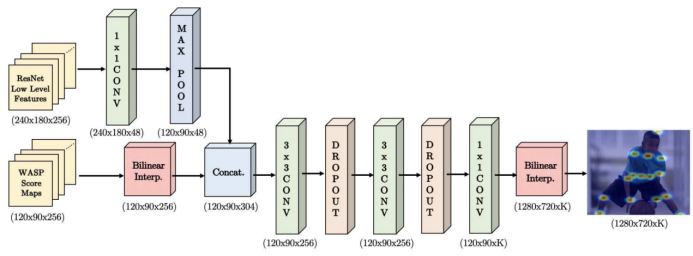
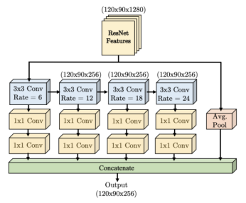

# 目录

<!-- TOC -->

- [目录](#目录)
- [UniPose说明](#UniPose说明)
- [模型架构](#模型架构)
- [数据集](#数据集)
- [环境要求](#环境要求)
- [快速入门](#快速入门)
- [脚本说明](#脚本说明)
    - [脚本及样例代码](#脚本及样例代码)
    - [脚本参数](#脚本参数)
    - [训练过程](#训练过程)
<!-- /TOC -->

# UniPose说明
本项目所复现的是Bruno Artacho等人于2020年提出的用于人体姿态估计的UniPose模型。论文网址
[UniPose: Unified Human Pose Estimation in Single Images and Videos (thecvf.com)](<extension://idghocbbahafpfhjnfhpbfbmpegphmmp/assets/pdf/web/viewer.html?file=https%3A%2F%2Fopenaccess.thecvf.com%2Fcontent_CVPR_2020%2Fpapers%2FArtacho_UniPose_Unified_Human_Pose_Estimation_in_Single_Images_and_Videos_CVPR_2020_paper.pdf>)

# 模型架构

可以看出，输入图像最初被送入一个深度卷积神经网络（此处是Resnet-101，无最后的全连接层），CNN的输出随后被送入WASP模块，其生成的特征图再由一个解码器网络处理，该解码器网络会使用Softmax和双线性插值为总共K个关节中的每一个都生成对应的热力图，其代表了该关节的位置在空间中的概率分布。随后我们就可以通过局部最大值操作来根据这些热力图确定关键点的精确位置。

解码器网络的结构：


WASP模块的结构：



可以看出，WASP模块会把ResNet提取到的特征通过一系列级联的膨胀因子逐渐增大的膨胀卷积层，每经过一次膨胀卷积都会创建出一条新的分支，形成一种如瀑布般的结构，最后再把各分支的输出以及对原始特征进行平均池化的结果进行拼接，即可得到WASP模块的输出。

# 数据集
原论文中，作者在四个数据集上对模型进行了实验。其中两个数据集由单个图像组成：Leeds Sports Pose（LSP）和MPII，另外两个数据集由视频序列组成：Penn Action和BBC Pose。但在本项目中，我们只在LSP数据集上对模型进行训练和测试。以下是关于LSP的一些简要介绍。

使用的LSP数据集：

- [启智平台下载LSP](<https://git.openi.org.cn/theh04/Uni/datasets>)
- [LSP官网下载](<http://sam.johnson.io/research/lsp.html>)

Leeds Sports Pose 是一个体育姿势数据集，其被分为羽毛球、棒球、体操、跑酷、足球、排球和网球等几类，共包含2000张带姿态注释的图像，其中1000张构成了训练集，另外1000张构成了测试集。每张图像均为3通道的彩色图像，并且都标注有14个关节的位置。其具体文件结构如下所示。

```text
├── LSP
  ├── VAL                      # 测试集（1k张图片）
  │   ├──joints_test.mat
  │   ├──im1001.jpg
  │   ├── ...
  │   ├──im2000.jpg
  ├── TRAIN                    # 训练集（1k张图片）
  │   ├──joints_train.mat
  │   ├──im0001.jpg
  │   ├── ...
  │   ├──im1000.jpg
  ├── images                   # 未划分的所有图像（2k张图片）
  │   ├──im0001.jpg
  │   ├── ...
  │   ├──im2000.jpg
  └── README.txt               # LSP数据集相关介绍

```

其中joints_train.mat和joints_test.mat 均为MATLAB数据文件，是一个3×14×1000的数组，包含对各张图片的关节注解。每张图片的每个关节都带有x和 y坐标和一个二进制值，指示每个关节的位置和可见性。关节的顺序如下：Right ankle，Right knee，Right hip，Left hip，Left knee，Left ankle，Right wrist，Right elbow，Right shoulder，Left shoulder，Left elbow，Left wrist，Neck，Head top。


- 数据集大小：22 MB
    - 训练集：1000张图像
    - 验证集：1000张图像
    - 标注：共2000张图像的关键点标注信息
- 数据格式：图像和mat文件
    - 注意：数据在dataset.py中处理

# 环境要求

- 所用硬件环境：Ascend910 *1
- MindSpore版本：1.5.1
- python第三方库等说明：numpy、opencv


# 脚本说明

## 脚本及样例代码

```text
├── Uni
  ├── README.md              # UniPose的英文描述（暂无，可参考原论文）
  ├── README_CN.md           # UniPose的中文描述（暂无，可参考原论文）
  ├── data
│   ├── LSP
│   │   ├── VAL                      # 测试集（1k张图片）
│   │   ├── TRAIN                    # 训练集（1k张图片）
│   │   ├── images                   # 未划分的所有图像（2k张图片）
│   │   └── README.txt
├── src
  │   ├── config.py           # 网络参数设置
  │   ├── dataset.py          # 创建训练/测试集
  │   ├── eval.py             # 在训练过程中对模型进行测试，精度计算（用于epoch_end的测试）
  │   ├── loss.py             # 定义损失函数
  │   ├── transforms.py       # 进行图像数据增强时需要用到的图像变换函数
  │   ├── utils.py            # 项目中需要用到的其它函数
  ├── model
  │   ├── decoder.py          # 解码器网络的定义
  │   ├── resnet.py           # Resnet的定义
  │   ├── resnet2.py          # ResnetV2的定义（***暂未用到***）
  │   ├── unipose.py          # UniPose模型的定义，会综合使用各个网络模块
  │   ├── wasp.py             # WASP网络模块的定义
  ├── n_train.py              # 启智集群启动Ascend上多卡训练的程序
  ├── online_train.py         # 智算网络集群启动Ascend上单卡训练的程序
  ├── qizhi_train.py          # 启智集群启动Ascend上单卡训练的程序
  └── train.py                # 本地启动CPU上训练的程序
```

## 脚本参数

  ```text
  config文件中中主要参数如下：
  config = edict()
config.IS_DISTRIBUTE = False
config.IS_MODELART = True
config.CACHE_INPUT = '/cache/dataset'
config.CACHE_TRAIN = '/LSP/TRAIN'
config.CACHE_VAL = '/LSP/VAL'

config.train_dir = 'data/LSP/TRAIN'
config.val_dir = 'data/LSP/VAL'
config.starter_epoch = 0
config.epochs = 110
config.epochs2 = 100
config.pretrained = None #"model/resnet101.ckpt"


config.workers = 2
config.weight_decay = 0.005
config.momentum = 0.9
config.dataset_size = 1000
config.batch_size = 1  # 8
config.TEST_batch_size = 1 
config.lr = 0.0001
config.gamma = 0.333
config.step_size = 8000 # epoch_size= step / (1000/batch)
config.sigma = 3
config.stride = 1 # 8
config.numClasses = 14


config.height = 184
config.width = 92

config.heatmap_h = round(config.height / config.stride)
config.heatmap_w = round(config.width / config.stride)


  ```

## 训练过程

在启智平台上运行`qizhi_train.py`训练模型。


```text
epoch: 1 step: 1000, loss is 0.18175468
epoch time: 221604.456 ms, per step time: 221.604 ms
[WARNING] SESSION(309,fffe7b7fe160,python):2022-08-12-14:06:46.128.136 [mindspore/ccsrc/backend/session/ascend_session.cc:1806] SelectKernel] There are 125 node/nodes used reduce precision to selected the kernel!
Val   loss:  0.12083356
mPCK@0.2:  62.13%
PCK@0.2 s:    Void = 62.72%, Right Ankle = 54.37%,  Right Knee = 58.79%,   Right Hip = 68.86%,       Left Hip = 73.61%,
    Left Knee = 72.89%,  Left Ankle = 72.34%, Right Wrist = 25.98%, Right Elbow = 50.44%, Right Shoulder = 51.71%,
Left Shoulder = 56.96%,  Left Elbow = 76.67%,  Left Wrist = 75.18%,        Neck = 76.78%,       Head Top = 55.18%
mPCKh@0.5: 52.58%
PCKh@0.5 s:   Void = 54.88%, Right Ankle = 37.86%,  Right Knee = 46.06%,   Right Hip = 64.14%,       Left Hip = 69.35%,
    Left Knee = 54.82%,  Left Ankle = 42.55%, Right Wrist = 16.49%, Right Elbow = 44.21%, Right Shoulder = 44.86%,
Left Shoulder = 51.14%,  Left Elbow = 72.62%,  Left Wrist = 69.83%,        Neck = 72.28%,       Head Top = 49.84%
Best epoch 1 ; PCK@0.2 = 62.13%; PCKh@0.5 = 52.58%
epoch: 2 step: 1000, loss is 0.06335213
epoch time: 18563.981 ms, per step time: 18.564 ms
...

```

